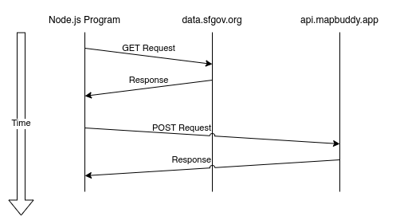
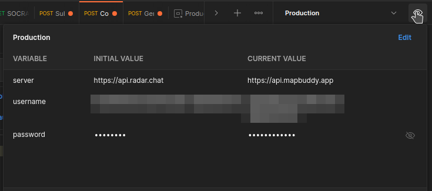

# Nodeschool SF API Interaction

In this lesson you're going to build a Node.js program to read data from the San Francisco Data API, and then write it to the Map Buddy API. These sorts of interactions are common amongst services written using Node.js.

Here's a diagram of what your application will be doing:



The first step when working with APIs is to read the documentation. In this case, there are two sets of documentations that you'll read about. For the SF data, we're going to work with data reports made from SF 311 calls. You'll also need the documentation for Map Buddy:

- [SF 311 Cases API Docs](https://dev.socrata.com/foundry/data.sfgov.org/vw6y-z8j6)
- [Map Buddy API Docs](https://docs.mapbuddy.app/)

## Application Preparation

First, make a new directory somewhere for your project. Then, using your terminal, traverse into the directory. Once you're in the directory, initialize a new npm project. And finally, install version 2 of the `node-fetch` package. This process may look something like the following:

```sh
mkdir node-project
cd node-project
npm init -y
npm install node-fetch@2
```

We'll use an older version of `node-fetch` to ensure it works with the version of Node.js that everyone could have installed. Read the [Node Fetch Documentation](https://www.npmjs.com/package/node-fetch) if you're curous how it works.

## SF 311 Preparation

> The SF 311 API allows you to get information about SF 311 requests. These requests are associated with the physical location that the request was made for, and the time that the request was made. Additional data about the request is also provided in the response.

The SF Data APIs are all hosted by a service called Socrata. They do allow you to optionally create a user account which allows you to authorize your requests. The main benefit seems to be to allow higher requests rates, which we don't necessarily need, so for now we'll just not make an account.

Here's the URL to get data from:

```
https://data.sfgov.org/resource/vw6y-z8j6.json
```

Just making a request to this URL gives you a JSON response, which is an array of objects. Here's a truncated example of the response:

```json
[
  {
    "service_request_id": "15631421",
    "requested_datetime": "2022-07-29T12:01:33.000",
    "updated_datetime": "2022-07-29T12:01:34.000",
    "status_description": "Open",
    "status_notes": "open",
    "agency_responsible": "Clear Channel - Transit Queue",
    "service_name": "Damaged Property",
    "service_subtype": "Damaged Transit_Shelter_Platform",
    "service_details": "Transit_Shelter_Platform",
    "address": "Intersection of CHURCH ST and DUBOCE AVE",
    "street": "CHURCH ST",
    "supervisor_district": "8",
    "neighborhoods_sffind_boundaries": "Duboce Triangle",
    "police_district": "PARK",
    "lat": "37.76943268329",
    "long": "-122.429140599703",
    "point": {
      "latitude": "37.76943268",
      "longitude": "-122.4291406",
      "human_address": "{\"address\": \"\", \"city\": \"\", \"state\": \"\", \"zip\": \"\"}"
    },
    "source": "Mobile/Open311"
  }
]
```

The API lets you perform further queries based on parameters that you feed to it. For example, here's a complex query:

```
https://data.sfgov.org/resource/vw6y-z8j6.json?$select=service_request_id,requested_datetime,service_name,service_subtype,service_details,address,lat,long&$order=service_request_id desc&$where=service_request_id > 14813843&$limit=1000
```

Read the API docs for further details on how to use it.

Here's an example of how to make a basic request to this URL to get data:

```javascript
const fetch = require('node-fetch');

async function main() {
  const response = await fetch('https://data.sfgov.org/resource/vw6y-z8j6.json');
  const records = await response.json();
  console.log(records);
}
main();
```

Save this to a file named `program.js` inside of your working directory. To run your program, execute the following in your terminal:

```sh
node program.js
```

You should see a lot of JSON data printed to the screen. If not, check the file for errors and make sure you have Node.js isntalled.

## Map Buddy Preparation

> Map Buddy is a service that allows users to create and subscribe to maps. Using the API, you may then add posts to maps that you create. It then allows you to visualize the posts that you've created on a webpage.

To use Map Buddy, you'll first need to create an account. This is common with APIs where you're actually creating resources or writing changes. Here's a list of the steps that you'll need to complete:

1. Create a Map Buddy account
2. Confirm your Map Buddy account
3. Create a Map
4. Create posts (using your Node.js program)

These first three steps can be performed outside of your Node.js program. In fact, there's a tool to make the process straightforward. The Postman desktop application is a free tool for interacting with HTTP APIs. Install it here:

- [Install Postman](https://www.postman.com/downloads/)

Once you have the application installed, download the two Postman Collection files from the Map Buddy API docs:

- [Download Map Buddy Postman Collection](https://docs.mapbuddy.app/#postman-collection)

Next, go to _File_ > _Import_ within the Postman interface. Select the two files that you've downloaded to import them. This will give you an entire list of all the endpoints that are available to Map Buddy.

### Create a Map Buddy Account

Within Postman, use the _Authorization_ > _Generate Auth Email_ endpoint to start the account creation process. In the _Body_ tab, you'll need to add your email address to the JSON object. This represents the request payload. Once you've updated the payload, click the _Send_ button.

In HTTP parlance, the request that you're sending looks something like this:

```
POST https://api.mapbuddy.app/v2/auth/emailtoken
Content-Type: application/json
Accept: application/json

{
  "email": "user@example.org"
}
```

The response to this request should look like the following:

```json
{
  "ok": true
}
```

If you get a different message then there might have been a problem. Check that your email address is correct.

Shortly after you should receive an email. Don't click the button in the email.

### Confirm your Map Buddy Account

The email that you receive should contain an 8 character code. Copy the code from the email but do not click the authentication button. If you do click the button then the code is no longer viable and you'll need to repeat the previous step.

Once you have the code, open Postman and use the _Authorization_ > _Confirm Auth Code_ endpoint, substituting the eight character code that you were mailed in the _Body_ tab. Once that's done, click Send. The HTTP request ultimately resembles the following:

```
POST https://api.mapbuddy.app/v2/auth/confirm
Content-Type: application/json
Accept: application/json

{
  "code": "GJWXENDB"
}
```

The response to this request contains important information. You'll want to save this response to a file so that you can refer to it later. Here's an example response:

```json
{
  "user_id": "9515bf8d-39d0-423d-b18d-df24de27e188",
  "auth_token": "TP3lVOld09cE",
  "admin": true,
  "admin_panel": true,
  "username": "tlhunter",
  "authorization_raw": "9515bf8d-39d0-423d-b18d-df24de27e188:TP3lVOld09cE",
  "authorization_header": "Basic OTUxNWJmOGQtMzlkMC00MjNkLWIxOGQtZGYyNGRlMjdlMTg4OlRQM2xWT2xkMDljRQo=",
  "using_default_username": false
}
```

The important part of this response is the `authorization_header` field. This will be used the application when sending requests. But, some of the other fields are also useful when interacting using Postman. Specifically, the `user_id` and `auth_token` fields. In fact, lets enter them now.

In the upper right corner of Postman, you should see the word _Production_, which is the name of the Postman environment imported from the Map Buddy collection, and next to that is an eye ball icon. Click that icon. Next, click the _Edit_ link in the popup.



In the _Current Value_ dropdown, change the _username_ field to the `user_id` response value. Also, change the _password_ field to be the `auth_token` response value. Once you've done that, all future requests made using Postman will be authenticated using your account.

### Create a Map

At this point you're ready to create a map to put posts in. Since there are many folks creating a map for this experiment, not everyone can use the same map name. So, I suggest making a map and naming it after whatever username you often use on the internet.

In Postman, select the _Map_ > _Create Map_ endpoint. Modify the _Body_ payload so that it resembles the following:

```json
{
  "name": "<YOUR_USERNAME_HERE>",
  "listable": true,
  "password": null,
  "non_member_read": true,
  "non_member_write": false,
  "member_write": false,
  "description": "Just an experiment",
  "origin": {
    "lat": 37.7661,
    "lon": -122.4423,
    "zoom": 11
  },
  "capabilities": {
    "permanent": true,
    "beacon": true
  }
}
```

You should get a response that looks something like this:

```json
{
  "id": "f179eebe-0ab5-447c-ae3d-d4eeb8872ca1",
  "name": "tlhunter",
  "listable": true,
  "created": "2022-07-30T18:34:34.277Z",
  "non_member_read": true,
  "non_member_write": false,
  "member_write": false,
  "description": "Just an experiment",
  "virtual": false,
  "capabilities": {
    "beacon": true,
    "permanent": true
  },
  "origin": {
    "lat": 37.7661,
    "lon": -122.4423,
    "zoom": 11
  },
  "website": null,
  "post_sort": null,
  "icon": null,
  "has_password": false,
  "member_count": 1,
  "is_member": true,
  "is_admin": true
}
```

If you get a different response, check your request body for any errors.

Keep track of the map name that you have chosen. You'll need it next when you add posts to the map.

## Creating Resources

You're now ready to update your Node.js program. Modify your `program.js` file to look like the following, substituting the appropriate data:

```javascript
const fetch = require('node-fetch');

const RADAR_MAP = '<YOUR MAP NAME>';
const AUTH = '<YOUR AUTHORIZATION HEADER>';


async function main() {
  const response = await fetch('https://data.sfgov.org/resource/vw6y-z8j6.json');
  const records = await response.json();
  console.log('got records', records.length);
  await createEntries(records);
}
main();

async function createEntries(records) {
  for (let record of records) {
    const time = new Date(record.requested_datetime + '-07:00');
    const payload = {
      message: record.service_name,
      lat: Number(record.lat),
      lon: Number(record.long),
      created: time.toISOString(),
      level: 'beacon',
      replies: true
    };

    const response = await fetch(`https://api.mapbuddy.app/v2/maps/${RADAR_MAP}/posts`, {
      method: 'POST',
      body: JSON.stringify(payload),
      headers: {
        'Content-Type': 'application/json',
        Authorization: AUTH,
      },
    });

    const body = await response.json();

    if (body.error) {
      console.error(body);
      throw new Error('unable to create');
    }

    console.log(body);
    process.exit(); // uncomment to import everything
  }
}
```

Your program may run for a while at this point as it creates map posts. It'll probably create 1,000 of them if you haven't changed any of the filters.

## Viewing your Map

To view your map, copy the following into your browser and replace the name of your map:

```
https://app.mapbuddy.app/map/<MAP NAME>
```

## Optional Enhancements / Homework

- Are there additional APIs with sources of data you can find to add to the map?
- Can you modify the program so that it runs a web server and only goes through this process when your server receives a request?
- How would you modify the application to only request certain fields or ranges of data from SF 311?
  - Hint: Look into the `URLSearchParams` object in JavaScript.
- How would you design a "bot" that runs nightly to fetch results? Keep in mind you don't want to create the same thing twice.
